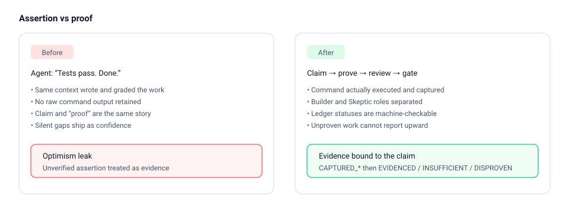
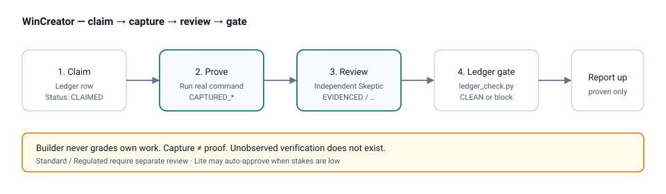
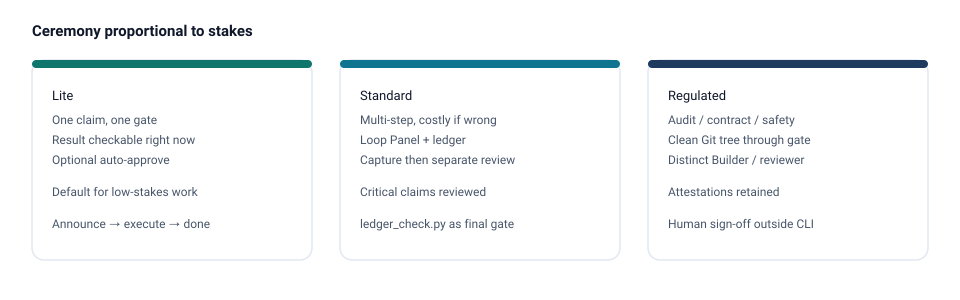

# WinCreator

**Stop your AI agent from turning “the command passed” into “the claim is true.”**

WinCreator gives agent work a small proof protocol: write the claim, run the real gate, capture what happened, and only then decide whether the evidence actually proves the claim.

[](https://github.com/winterbim/wincreator/actions/workflows/ci.yml?query=branch%3Amaster)
[](LICENSE)
[](https://github.com/winterbim/wincreator/releases/latest)



## The 10-second path

Install the skill:

```bash
npx skills add winterbim/wincreator
```

Then prove one explicit claim with one real command:

```bash
export WC=~/.claude/skills/wincreator
python3 "$WC/scripts/quick_prove.py" \
  "parser rejects malformed input" \
  -- python3 check_parser.py
```

That single command:

1. creates a minimal `.wincreator/PROOF_LEDGER.md` if needed;
2. creates a unique claim ID;
3. binds the exact plain-language claim to the exact command;
4. captures stdout, stderr, exit status, timing, environment and Git context;
5. writes a tamper-evident attestation;
6. marks a successful **Lite** proof `EVIDENCED` automatically.

No hand-written ledger is required for the default path.

A passing command is still not magical proof. The claim remains explicit so a higher-stakes run can be reviewed independently instead of collapsing into “exit 0 = truth.”

## Why this is different from running tests

An agent can run a green test suite and still make a false statement because the test may not cover the claim it is being used to justify.

WinCreator separates two questions:

```text
Did the command succeed?        -> CAPTURED_PASS / FAIL / ERROR
Does that evidence prove this?  -> EVIDENCED / INSUFFICIENT / DISPROVEN
```

That separation is the core of the project.



## Standard: same entry point, independent review

For consequential work, keep the same one-line creation path but require a separate review:

```bash
python3 "$WC/scripts/quick_prove.py" \
  "migration preserves every legacy permission" \
  --tier standard \
  -- python3 tests/test_migration.py
```

A green command becomes `PENDING`, not `EVIDENCED`.

The capture prints the generated claim ID. A separate reviewer then evaluates whether the captured gate really proves the claim:

```bash
python3 "$WC/scripts/wincreator.py" review <CLAIM_ID> \
  --ledger .wincreator/PROOF_LEDGER.md \
  --verdict evidenced \
  --reviewer skeptic-01
```

The reviewer may instead record `INSUFFICIENT` or `DISPROVEN`.

This is the failure mode WinCreator is built to catch:

```text
tests green
    ↓
agent wants to say DONE
    ↓
review notices the test never exercised one part of the claim
    ↓
INSUFFICIENT
```

## Three tiers



| Tier | Use it when | Behavior |
|---|---|---|
| **Lite** | one claim, one gate, directly inspectable | zero-setup proof, automatic mechanical approval |
| **Standard** | multi-step or expensive-to-miss failure | captured gate + separate review |
| **Regulated** | audited / contractual / safety / compliance-relevant work | Standard + clean Git state, distinct builder/reviewer IDs, retained attestations and surrounding human sign-off policy |

If you cannot name why the task needs Standard, use Lite.

`Regulated` is a workflow tier, **not a compliance certification**. HMAC is tamper evidence for a key holder, not a public signature or transparency log.

## Full protocol

The installable skill adds three defenses to longer agent sessions:

- **Optimism leak** → Proof Ledger + Builder/Skeptic separation
- **Context rot** → Loop Panel
- **Stuck loops** → Two-Failure Rule

Read [`skill/wincreator/SKILL.md`](skill/wincreator/SKILL.md) for the complete protocol.

For a real session where a Skeptic caught a missing error path after green tests, see [`skill/wincreator/references/worked-example.md`](skill/wincreator/references/worked-example.md).

## Manual capture API

If you already maintain a ledger row, use the lower-level CLI directly:

```bash
python3 "$WC/scripts/wincreator.py" prove P2 \
  --tier standard \
  --builder builder-01 \
  --ledger PROOF_LEDGER.md \
  -- python3 check_parser.py
```

Review:

```bash
python3 "$WC/scripts/wincreator.py" review P2 \
  --ledger PROOF_LEDGER.md \
  --verdict evidenced \
  --reviewer skeptic-01
```

Verify capture logs, review linkage and ledger bindings:

```bash
python3 "$WC/scripts/wincreator.py" verify --ledger PROOF_LEDGER.md
```

## Sensitive data

Captured output and metadata can contain secrets. Use the built-in controls before execution:

```bash
python3 "$WC/scripts/quick_prove.py" \
  "private integration check succeeds" \
  --redact "$TOKEN" \
  --redact-regex 'password=[^ ]+' \
  --max-output-bytes 1048576 \
  --no-output-body \
  --private \
  -- python3 check_integration.py
```

Redaction occurs before retained output is hashed. The gate process never inherits `WINCREATOR_SIGNING_KEY`; signing happens only after the gate exits.

## Other installation paths

**Claude Code — manual copy**

```bash
git clone https://github.com/winterbim/wincreator.git
mkdir -p ~/.claude/skills
cp -r wincreator/skill/wincreator ~/.claude/skills/wincreator
python3 ~/.claude/skills/wincreator/scripts/ledger_check.py --self-test
python3 ~/.claude/skills/wincreator/scripts/wincreator.py --self-test
```

**ChatGPT / manual package**

Build or download `skill.zip`, then upload it:

```bash
./tools/build_package.sh
```

Release assets: [latest release](https://github.com/winterbim/wincreator/releases/latest).

## Development gates

```bash
python3 -m compileall -q skill/wincreator/scripts tools tests
python3 skill/wincreator/scripts/ledger_check.py --self-test
python3 skill/wincreator/scripts/wincreator.py --self-test
python3 skill/wincreator/scripts/package_check.py --self-test
python3 -m pytest -q
python3 skill/wincreator/scripts/package_check.py skill/wincreator
python3 skill/wincreator/scripts/ledger_check.py --catches skill/wincreator/SKEPTIC_CATCHES.md
./tools/build_package.sh
```

CI runs across Ubuntu, Windows and macOS on Python 3.10–3.13 and validates the packaged skill with the pinned OpenAI Skill Creator and Agent Skills reference validators.

## Project map

| Resource | Purpose |
|---|---|
| [`skill/wincreator/scripts/quick_prove.py`](skill/wincreator/scripts/quick_prove.py) | zero-setup default path |
| [`examples/minimal/`](examples/minimal/) | runnable sandbox |
| [`skill/wincreator/references/worked-example.md`](skill/wincreator/references/worked-example.md) | real Skeptic catch |
| [`skill/wincreator/SKILL.md`](skill/wincreator/SKILL.md) | full protocol |
| [`docs/DEMO.md`](docs/DEMO.md) | short demonstration flow |
| [Releases](https://github.com/winterbim/wincreator/releases) | packaged artifacts |

## License

MIT — see [LICENSE](LICENSE). Copyright Winter Fernandes.
